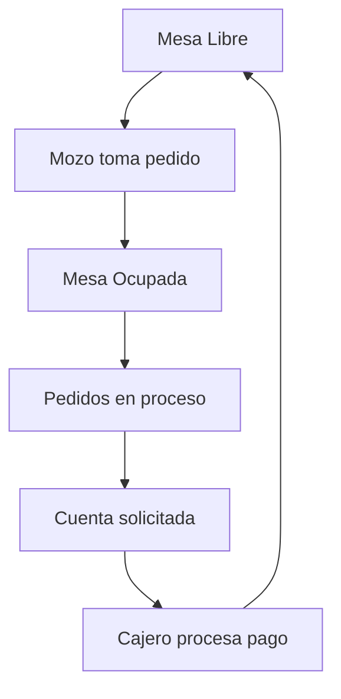
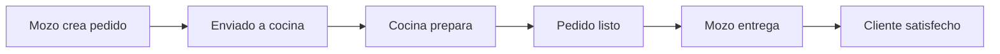

# 🍽️ SIRER - Sistema Integral para Restaurantes

[](https://nodejs.org/)
[](https://reactjs.org/)
[](https://www.postgresql.org/)
[](https://socket.io/)
[](LICENSE)
[](https://github.com/BrSilvinha)

Un sistema completo de gestión para restaurantes que permite administrar pedidos, mesas, inventario y personal en tiempo real con una interfaz moderna y funcionalidades específicas para cada rol.

## 🌟 Características Principales

### 📱 Sistema Multi-Rol
- **👑 Administrador**: Gestión completa del sistema, reportes y configuración
- **🍽️ Mozo**: Toma de pedidos, gestión de mesas y seguimiento de órdenes
- **👨‍🍳 Cocina**: Control de pedidos, cambio de estados y disponibilidad de productos
- **💰 Cajero**: Procesamiento de pagos, cuentas y reportes de ventas

### ⚡ Funcionalidades en Tiempo Real
- Notificaciones instantáneas entre roles usando Socket.io
- Actualización automática de estados de pedidos y mesas
- Alertas sonoras para nuevos pedidos y cambios importantes
- Sincronización en vivo de disponibilidad de productos

### 📊 Sistema de Reportes Avanzado
- Dashboard en tiempo real con métricas clave
- Reportes de ventas con filtros personalizables
- Análisis de rendimiento por mozo y mesa
- Productos más vendidos y estadísticas de inventario
- Exportación en PDF, Excel y CSV

### 🔐 Seguridad y Autenticación
- JWT con refresh tokens
- Middleware de autorización por roles
- Encriptación de contraseñas con bcrypt
- Validación de datos en frontend y backend

## 🛠️ Stack Tecnológico

### Backend
- **Node.js** + **Express.js** - Servidor web robusto
- **PostgreSQL** - Base de datos relacional
- **Sequelize ORM** - Modelado y consultas de base de datos
- **Socket.io** - Comunicación en tiempo real
- **JWT** - Autenticación y autorización
- **bcrypt** - Encriptación de contraseñas

### Frontend
- **React 18** - Biblioteca de interfaz de usuario
- **React Router** - Navegación SPA
- **Bootstrap 5** - Framework CSS responsivo
- **Chart.js** - Visualización de datos
- **Socket.io Client** - Cliente de tiempo real
- **Axios** - Cliente HTTP
- **React Hot Toast** - Notificaciones

## 🚀 Instalación y Configuración

### Prerrequisitos
- Node.js 18+
- PostgreSQL 14+
- npm o yarn

### 1. Clonar el Repositorio
```bash
git clone https://github.com/BrSilvinha/sirer-restaurant-system.git
cd sirer-restaurant-system
```

### 2. Configurar Backend
```bash
cd backend
npm install

# Crear archivo de configuración
cp .env.example .env
```

**Configurar variables de entorno en `.env`:**
```env
# Base de datos
DB_HOST=localhost
DB_PORT=5432
DB_NAME=sirer_db
DB_USER=tu_usuario
DB_PASSWORD=tu_password

# JWT
JWT_SECRET=tu_jwt_secret_muy_seguro
JWT_REFRESH_SECRET=tu_refresh_secret_muy_seguro

# Servidor
PORT=5000
NODE_ENV=development

# Socket.io
SOCKET_ORIGIN=http://localhost:3000
```

**Crear base de datos:**
```sql
CREATE DATABASE sirer_db;
```

### 3. Configurar Frontend
```bash
cd ../frontend
npm install

# Crear archivo de configuración
cp .env.example .env
```

**Configurar variables de entorno en `.env`:**
```env
REACT_APP_API_URL=http://localhost:5000/api
REACT_APP_SOCKET_URL=http://localhost:5000
```

### 4. Inicializar Base de Datos
```bash
cd ../backend
npm run migrate
npm run seed
```

### 5. Ejecutar el Sistema
```bash
# Terminal 1 - Backend
cd backend
npm run dev

# Terminal 2 - Frontend
cd frontend
npm start
```

El sistema estará disponible en:
- **Frontend**: http://localhost:3000
- **Backend API**: http://localhost:5000
- **Socket.io**: http://localhost:5000

## 👥 Usuarios de Prueba

| Rol | Email | Contraseña | Descripción |
|-----|-------|------------|-------------|
| 👑 Admin | admin@sirer.com | admin123 | Acceso completo al sistema |
| 🍽️ Mozo | mozo@sirer.com | mozo123 | Gestión de mesas y pedidos |
| 👨‍🍳 Cocina | cocina@sirer.com | cocina123 | Control de cocina y preparación |
| 💰 Cajero | cajero@sirer.com | cajero123 | Procesamiento de pagos |

## 📋 Estructura del Proyecto

```
sirer-restaurant-system/
├── backend/
│   ├── config/
│   │   ├── database.js          # Configuración PostgreSQL
│   │   └── socket.js            # Configuración Socket.io
│   ├── controllers/             # Lógica de negocio
│   ├── middleware/              # Middlewares de autenticación
│   ├── models/                  # Modelos Sequelize
│   ├── routes/                  # Rutas de la API
│   ├── utils/                   # Utilidades y helpers
│   └── server.js               # Punto de entrada
│
├── frontend/
│   ├── public/
│   ├── src/
│   │   ├── components/          # Componentes React
│   │   │   ├── admin/          # Componentes de administrador
│   │   │   ├── cajero/         # Componentes de cajero
│   │   │   ├── cocina/         # Componentes de cocina
│   │   │   ├── mozo/           # Componentes de mozo
│   │   │   └── common/         # Componentes compartidos
│   │   ├── context/            # Context API (Auth, Socket)
│   │   ├── hooks/              # Custom hooks
│   │   ├── services/           # Servicios API
│   │   └── utils/              # Utilidades
│   └── package.json
│
├── README.md
└── package.json
```

## 🔄 Flujo de Trabajo del Sistema

### 1. Gestión de Mesas


### 2. Proceso de Pedidos


## 🌐 API Endpoints

### Autenticación
```
POST /api/auth/login          # Iniciar sesión
POST /api/auth/register       # Registrar usuario
POST /api/auth/refresh        # Renovar token
GET  /api/auth/profile        # Obtener perfil
```

### Mesas
```
GET    /api/mesas             # Listar mesas
POST   /api/mesas             # Crear mesa
PUT    /api/mesas/:id         # Actualizar mesa
DELETE /api/mesas/:id         # Eliminar mesa
PATCH  /api/mesas/:id/estado  # Cambiar estado
```

### Pedidos
```
GET  /api/pedidos             # Listar pedidos
POST /api/pedidos             # Crear pedido
GET  /api/pedidos/cocina      # Pedidos para cocina
PATCH /api/pedidos/:id/estado # Cambiar estado
```

### Reportes
```
GET /api/reportes/dashboard   # Dashboard principal
GET /api/reportes/ventas      # Reporte de ventas
GET /api/reportes/productos   # Productos más vendidos
```

## 🔧 Scripts Disponibles

### Backend
```bash
npm run dev          # Servidor de desarrollo con nodemon
npm run start        # Servidor de producción
npm run migrate      # Ejecutar migraciones
npm run seed         # Poblar base de datos
npm run test         # Ejecutar tests
```

### Frontend
```bash
npm start            # Servidor de desarrollo
npm run build        # Build de producción
npm run test         # Ejecutar tests
npm run analyze      # Analizar bundle
```

## 📊 Características del Dashboard

### Métricas en Tiempo Real
- **Ventas del día**: Total de ingresos
- **Pedidos activos**: Estados en tiempo real
- **Ocupación de mesas**: Porcentaje de utilización
- **Productos más vendidos**: Top rankings

### Visualización de Datos
- Gráficos de barras para ventas diarias
- Gráficos circulares para estados de mesas
- Tablas interactivas con filtros
- Exportación en múltiples formatos

## 🔐 Seguridad Implementada

- ✅ Autenticación JWT con refresh tokens
- ✅ Autorización basada en roles
- ✅ Validación de datos en backend y frontend
- ✅ Encriptación de contraseñas
- ✅ Sanitización de inputs
- ✅ Rate limiting para APIs
- ✅ CORS configurado correctamente

## 🚀 Despliegue en Producción

### Docker (Recomendado)
```bash
# Construir imágenes
docker-compose build

# Ejecutar servicios
docker-compose up -d
```

### Manual
1. Configurar variables de entorno de producción
2. Build del frontend: `npm run build`
3. Configurar nginx como proxy reverso
4. Configurar PM2 para el backend
5. Configurar SSL/TLS con Let's Encrypt

## 🤝 Contribuir

1. Fork el proyecto
2. Crea una rama para tu feature (`git checkout -b feature/AmazingFeature`)
3. Commit tus cambios (`git commit -m 'Add some AmazingFeature'`)
4. Push a la rama (`git push origin feature/AmazingFeature`)
5. Abre un Pull Request

## 📝 Roadmap

### Versión 2.0
- [ ] Aplicación móvil con React Native
- [ ] Integración con sistemas de pago (Stripe, PayPal)
- [ ] Análisis predictivo de ventas
- [ ] Sistema de reservas online
- [ ] Integración con redes sociales

### Versión 2.1
- [ ] Multi-restaurante (cadenas)
- [ ] Sistema de fidelización de clientes
- [ ] Integración con delivery apps
- [ ] Dashboard para clientes

## 🐛 Reportar Bugs

Si encuentras un bug, por favor:
1. Verifica que no haya sido reportado anteriormente
2. Crea un issue detallado con:
   - Descripción del problema
   - Pasos para reproducir
   - Capturas de pantalla si aplica
   - Información del ambiente

## 📄 Licencia

Este proyecto está bajo la Licencia MIT. Ver [LICENSE](LICENSE) para más detalles.

## 👨‍💻 Autor

**Jhamir Silva** - [@BrSilvinha](https://github.com/BrSilvinha)

- 📧 Email: jhamirsilva@gmail.com

## 🙏 Agradecimientos

- Inspirado por las necesidades reales de restaurantes locales
- Comunidad open source por las librerías utilizadas
- Beta testers que ayudaron a mejorar la experiencia

---

⚡ **¿Te gustó el proyecto?** ¡Dale una ⭐ en GitHub!

**🍽️ SIRER - Donde la tecnología mejora la experiencia gastronómica**
